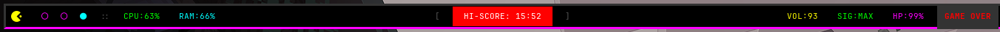
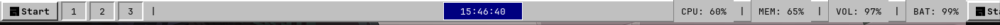
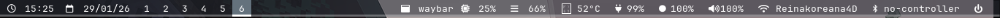

# waybar-colecsion-themes
# 🛰️ Waybar Colecsion Themes

Una colección personal de configuraciones para **Waybar**, optimizadas para Hyprland. Cada tema incluye su archivo de `config`, `style.css` y una captura de pantalla.

---

## 🎨 Temas Disponibles

| Vista Previa | Nombre del Tema | Ruta |
| :---: | :--- | :--- |
|  | **Arcade Grid** | `/Arcade-Grid` |
|  | **Axon Nebula** | `/AXON%20NEBULA` |
|  | **Neon Protocol** | `/NEON%20PROTOCOL` |
|  | **Glassy Pill Bar** | `/Glassy%20Pill%20Bar` |
|  | **Nova Float** | `/Nova%20Float` |
|  | **Retro** | `/retro` |
|  | **The Monolith** | `/The%20Monolith` |
|  | **V-Onyx** | `/V-Onyx` |

---

## 🚀 Cómo instalar un tema

1. **Clona el repo:**
   ```bash
   git clone [https://github.com/Elpepesaurio44/waybar-colecsion-themes.git](https://github.com/Elpepesaurio44/waybar-colecsion-themes.git)
